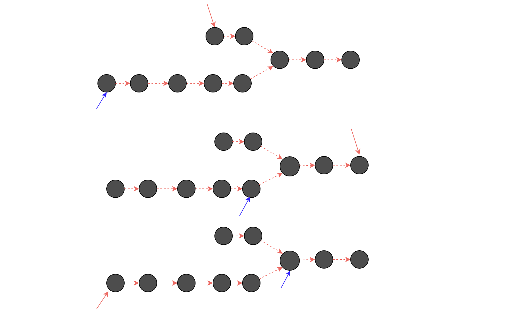

# Problem
Write a program to find the node at which the intersection of two singly linked lists begins.


For example, the following two linked lists:
```
A:          a1 → a2
                    ↘
                        c1 → c2 → c3
                    ↗
B:     b1 → b2 → b3
```
begin to intersect at node c1.


Notes:

If the two linked lists have no intersection at all, return null.
The linked lists must retain their original structure after the function returns.
You may assume there are no cycles anywhere in the entire linked structure.
Your code should preferably run in O(n) time and use only O(1) memory.

# Solution

基本思想是让两个链表同时达到intersection point。那么长的那个链表需要提前开始，那个提前量就是两个链表长度之差

更优的实现：

同时遍历，短的那个链表到达了尾部之后，调整指针，让它指向长链表的头部，继续，直到长链表遍历完。
最后，那第一个指针停的地方就是长链表应该开始的地方

示意图：


动态图：

