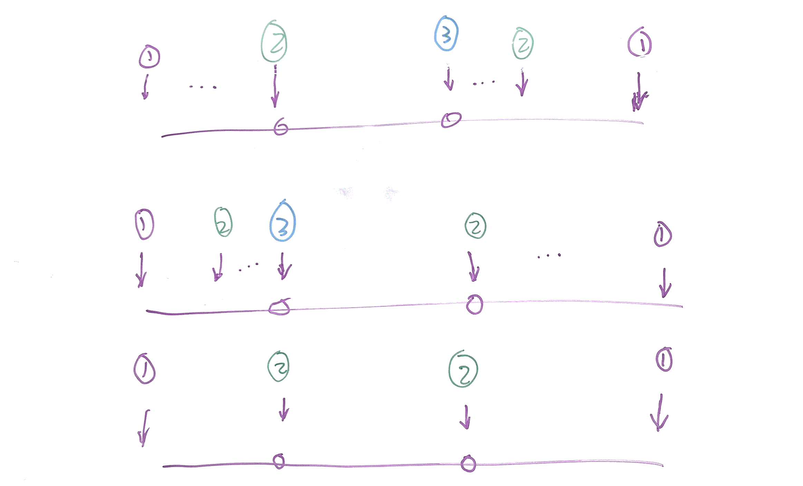

# Problem

Given an array of integers that is already **_sorted in ascending order_**,
find two numbers such that they add up to a specific target number.

The function twoSum should return indices of the two numbers such that they
add up to the target, where index1 must be less than index2. Please note that
your returned answers (both index1 and index2) are not zero-based.

You may assume that each input would have _exactly_ one solution and you may
not use the _same_ element twice.

**Input:** numbers={2, 7, 11, 15}, target=9  
**Output:** index1=1, index2=2 

[Two Sum II - Input array is sorted](https://leetcode.com/problems/two-sum-ii-input-array-is-sorted)

# Solution

这题很容易想到两个指针。但是如何证明为什么这是正确的？

一共有以上三种情况，注意指针是一步步挪动的。按照我们的算法，总有一个会先到达其中一个数。

