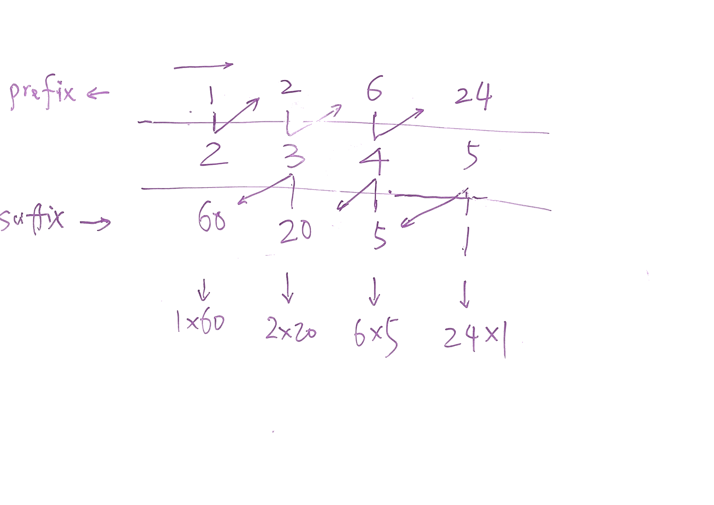

# Problem

Given an array of _n_ integers where _n_ > 1, `nums`, return an array `output`
such that `output[i]` is equal to the product of all the elements of `nums`
except `nums[i]`.

Solve it **without division** and in O(_n_).

For example, given `[1,2,3,4]`, return `[24,12,8,6]`.

**Follow up:**  
Could you solve it with constant space complexity? (Note: The output array
**does not** count as extra space for the purpose of space complexity
analysis.)

[Product of Array Except Self](https://leetcode.com/problems/product-of-array-except-self)

# Solution

注意这题的限制

思路是，我们可以利用两个数组，一个数组是前向所有数的积，另一个是后向所有数的积。这两个数组分别正序和反序迭代就可以得到。
这样结果就是，这两个数组对应的下标的两个数相乘。

但是，事实上，没必要两个数组，第二个数组完全可以不用，因为我们每个计算只依赖前面／后面一个，用变量保存即可。

