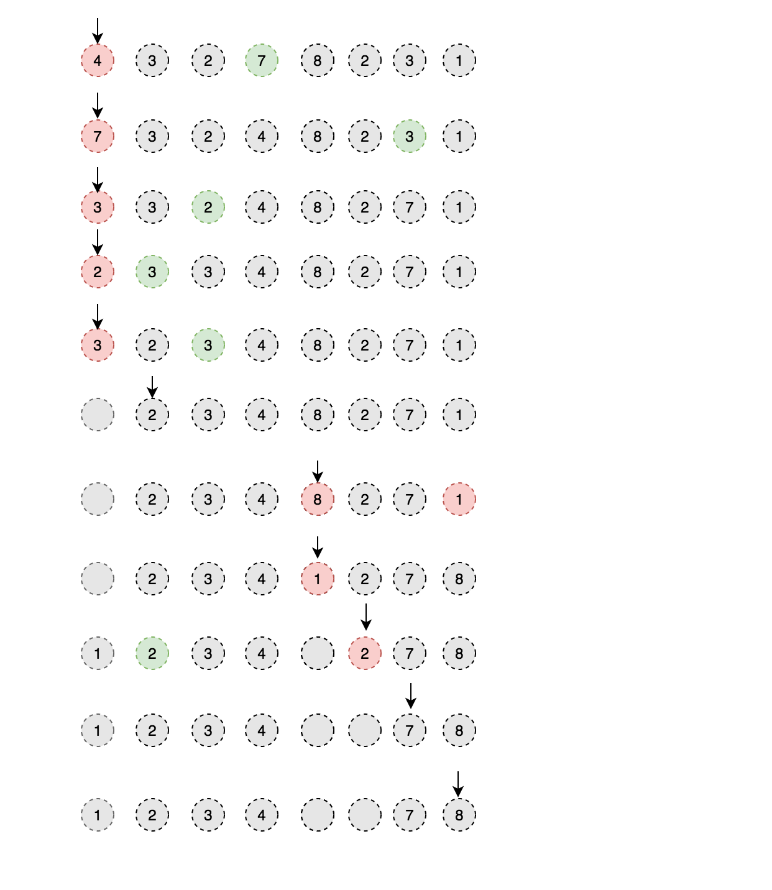

# Problem

Given an array of integers, 1 ≤ a[i] ≤ _n_ (_n_ = size of array), some
elements appear **twice** and others appear **once**.

Find all the elements that appear **twice** in this array.

Could you do it without extra space and in O(_n_) runtime?

**Example:**  

    ```
    **Input:**
    [4,3,2,7,8,2,3,1]
    **Output:**
    [2,3]
    ```


[Find All Duplicates in an Array](https://leetcode.com/problems/find-all-duplicates-in-an-array)

# Solution


注意题目的特殊条件，数组的数的范围。

这题思路就是把每个数和其下标有对应关系

把每个数交换到对应的位置，如果对应位置已被占，说明已经重复。

每次只交换不同的两个数，如果两个数一样，迭代加一，将其中一个数位置留空


