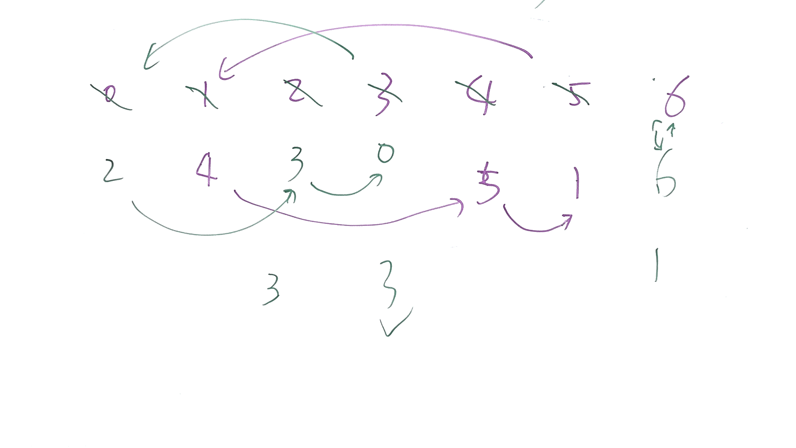

# Problem

A zero-indexed array A consisting of N different integers is given. The array
contains all integers in the range [0, N - 1].

Sets S[K] for 0 <= K < N are defined as follows:

S[K] = { A[K], A[A[K]], A[A[A[K]]], ... }.

Sets S[K] are finite for each K and should NOT contain duplicates.

Write a function that given an array A consisting of N integers, return the
size of the largest set S[K] for this array.

**Example 1:**  

    ```
    **Input:** A = [5,4,0,3,1,6,2]
    **Output:** 4
    **Explanation:** 
    A[0] = 5, A[1] = 4, A[2] = 0, A[3] = 3, A[4] = 1, A[5] = 6, A[6] = 2.  
    One of the longest S[K]:
    S[0] = {A[0], A[5], A[6], A[2]} = {5, 6, 2, 0}
    ```

**Note:**  

  1. N is an integer within the range [1, 20,000].
  2. The elements of A are all distinct.
  3. Each element of array A is an integer within the range [0, N-1].


[Array Nesting](https://leetcode.com/problems/array-nesting)

# Solution

从起点开始迭代，然后按嵌套下去，知道形成环路。

其中，走圈过程中，计数并标记已走过的（标记方法：用其负数表示方便恢复）

标记是为了后面略去迭代。

所以，基本上每个节点访问一次就完成了。时间复杂度是O(N)



上图中，实际只需要迭代3次。每次是一个圈。

