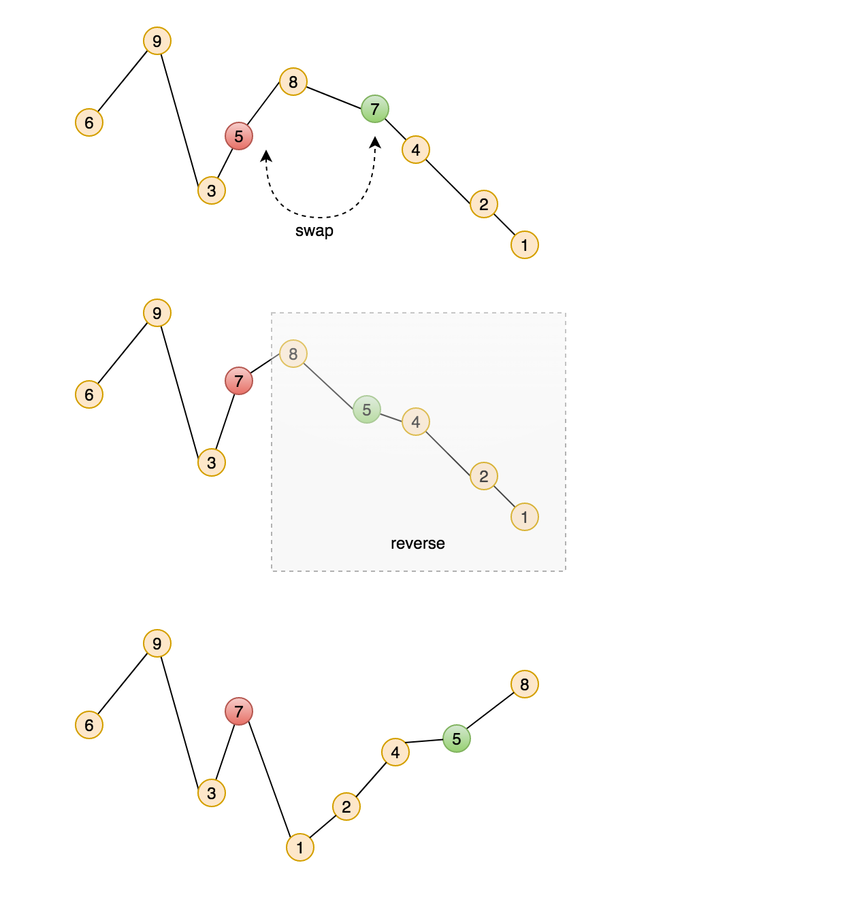

# Problem

Implement next permutation, which rearranges numbers into the
lexicographically next greater permutation of numbers.

If such arrangement is not possible, it must rearrange it as the lowest
possible order (ie, sorted in ascending order).

The replacement must be in-place, do not allocate extra memory.

Here are some examples. Inputs are in the left-hand column and its
corresponding outputs are in the right-hand column.

`1,2,3` → `1,3,2`

`3,2,1` → `1,2,3`

`1,1,5` → `1,5,1`

[Next Permutation](https://leetcode.com/problems/next-permutation)

# Solution

关键是下一个permutation的规律：

`a0, a1, a2, .., an`

右起找到第一个打破递减规律的数，这时，从此数右边递减序列中找到刚刚比此数大的数进行互换。
然后把右边递减序列反转

